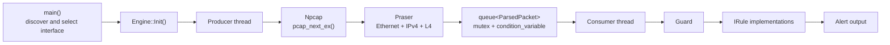

# MiniSnort

MiniSnort is a small, modular intrusion detection system (IDS) prototype for
Windows, written in C++17 and built directly on the Npcap packet-capture API.
It demonstrates raw packet capture, defensive protocol parsing, a pluggable
rule engine, and a producer-consumer processing model.

> MiniSnort is an educational portfolio project, not a production IDS.

## Features

- Discovers local capture interfaces and lets the user select one.
- Captures live Ethernet frames through Npcap.
- Parses Ethernet, IPv4, TCP, UDP, and ICMP headers.
- Performs bounds checks before reading packet data.
- Passes validated packet metadata to independent detection rules.
- Runs capture/parsing and rule evaluation on separate threads.
- Transfers parsed packets through a mutex-protected queue.
- Reports structured alerts to the console.

## Architecture



The `Engine` owns the runtime pipeline and coordinates its lifecycle:

1. `main()` uses `Sniffer` to discover capture interfaces and obtain the
   user's selection.
2. `Engine::Init()` opens the selected device, creates the parser and rule
   engine, and registers the available rules.
3. `Engine::Run()` starts one producer thread and one consumer thread.
4. The producer captures a packet, parses it into a `ParsedPacket`, pushes the
   result into the shared queue, and notifies the consumer.
5. The consumer waits on a condition variable, removes packets from the queue,
   and evaluates rules outside the queue lock.
6. When capture finishes, the producer signals the stop flag. The consumer
   drains the remaining queue and both threads join cleanly.

### Components

| Component | Files | Responsibility |
| --- | --- | --- |
| Entry point | `MiniSnort.cpp` | Lists interfaces, reads the user's choice, and starts the engine. |
| Capture discovery | `Sniffer.h/.cpp` | Wraps `pcap_findalldevs()` and releases the device list. |
| Runtime orchestration | `Engine.h/.cpp` | Opens the capture handle and coordinates capture, parsing, queueing, rule evaluation, shutdown, and thread joins. |
| Packet parser | `Praser.h/.cpp` | Bounds-checks and decodes Ethernet, IPv4, TCP, UDP, and ICMP metadata. The class name follows the spelling currently used in the source. |
| Packet model | `ParsedPacket.h` | Stores validated protocol metadata and protocol-presence flags. |
| Rule engine | `Guard.h/.cpp` | Owns registered rules and evaluates each rule for every parsed packet. |
| Example rule | `IPv4ArrivedRule.h` | Emits an informational alert when a valid IPv4 packet arrives. |

### Threading model

The producer and consumer communicate through:

- `std::queue<ParsedPacket>` for ownership transfer;
- `std::mutex` for queue access;
- `std::condition_variable` for efficient consumer wakeups; and
- `std::atomic<bool>` for stop coordination.

Only queue operations happen while the mutex is held. Parsing occurs before a
packet is queued, and rule evaluation occurs after it is removed, keeping the
critical section small.

## Packet model

`ParsedPacket` separates validated metadata from the raw capture buffer. It
contains:

- the Ethernet type;
- IPv4 source, destination, protocol, header length, and Layer 4 offset;
- TCP ports, flags, header length, and payload offset;
- UDP ports, datagram length, and payload offset;
- ICMP type, code, checksum, and payload offset; and
- flags identifying which protocol structures are present.

Non-IPv4 Ethernet frames can pass through the parser with only their Ethernet
type populated. IPv4 packets are classified as TCP, UDP, ICMP, or another
Layer 4 protocol.

## Rule engine

Rules implement the `IRule` interface:

```cpp
class IRule
{
public:
    virtual ~IRule() = default;
    virtual const std::string& Name() const = 0;
    virtual std::optional<Alert> Evaluate(
        const ParsedPacket& packet) const = 0;
};
```

The `Guard` owns rules with `std::unique_ptr`, so adding a rule does not require
changing its inspection loop:

```cpp
guard.AddRule(std::make_unique<SomeRule>());
std::vector<Alert> alerts = guard.Inspect(parsedPacket);
```

An `Alert` contains a severity, rule name, and message. The current
`IPv4ArrivedRule` is an end-to-end validation rule that emits an informational
alert for every successfully parsed IPv4 packet.

## Requirements

- Windows 10 or 11
- Visual Studio 2022 with the **Desktop development with C++** workload
- MSVC v143 and the Windows 10 SDK
- [Npcap](https://npcap.com/) runtime and SDK
- Administrator privileges, if required for packet capture on the selected
  interface

## Build

1. Clone the repository:

   ```powershell
   git clone https://github.com/BlueNightSN/MiniSnort.git
   cd MiniSnort
   ```

2. Install Npcap and download the Npcap SDK.

3. Open `MiniSnort.sln` in Visual Studio.

4. For the `MiniSnort` project, configure the SDK locations for the selected
   x64 configuration:

   - **C/C++ > General > Additional Include Directories**: the SDK `Include`
     directory.
   - **Linker > General > Additional Library Directories**: the SDK `Lib\x64`
     directory.

   The project file currently contains a machine-specific Npcap SDK path, so
   another checkout will normally need to update these two settings.

5. Select **Debug | x64** or **Release | x64**, then build the solution.

From a Visual Studio Developer PowerShell, the equivalent command is:

```powershell
msbuild MiniSnort.sln /p:Configuration=Debug /p:Platform=x64
```

The project links against `wpcap.lib`, `Packet.lib`, and `Ws2_32.lib`.

## Run

Start the built executable from an elevated terminal if capture permissions
require it:

```powershell
.\x64\Debug\MiniSnort.exe
```

MiniSnort prints the interfaces reported by Npcap. Enter the number of the
interface to monitor. The current prototype captures a small bounded batch of
packets, processes every queued packet, prints any alerts, and exits.

## Repository layout

```text
MiniSnort/
|-- README.md
|-- MiniSnort.sln
`-- MiniSnort/
    |-- MiniSnort.cpp
    |-- Engine.h / Engine.cpp
    |-- Sniffer.h / Sniffer.cpp
    |-- Praser.h / Praser.cpp
    |-- ParsedPacket.h
    |-- Guard.h / Guard.cpp
    |-- IPv4ArrivedRule.h
    `-- MiniSnort.vcxproj
```

## Current limitations

- Windows and Npcap only.
- Ethernet and IPv4 only; IPv6 and VLAN-tagged frames are not decoded.
- TCP, UDP, and ICMP parsing is limited to the metadata needed by the current
  prototype.
- One informational validation rule is registered.
- Capture uses a fixed packet batch rather than a long-running service loop.
- Alerts are written to the same console as the application.
- Npcap SDK paths are not yet portable between development machines.
- There is no automated test suite yet.

## Roadmap

- TCP anomaly rules such as NULL and XMAS scan detection
- Suspicious-port and stateful scan detection
- Configurable rules and thresholds
- Continuous capture with graceful user-triggered shutdown
- Dedicated alert output or IPC
- IPv6 and VLAN parsing
- Portable dependency configuration and automated tests
